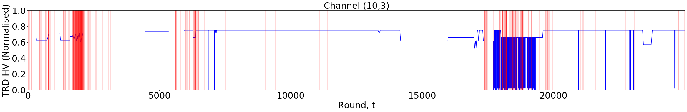
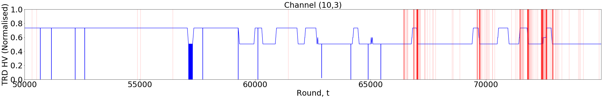
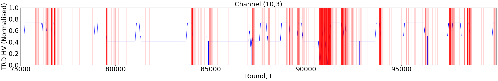

# An adversarial thresholding semi-bandit for ALICE DCS
AliceBandit is an adversarial multi-armed semi-bandit for the thresholding bandit problem with K arms. In a repeated game over T rounds, played against an oblivious adversary that generates feedback for each arm. A player decides which k out of K arms to pull each round, where 𝑘≤𝑘
and the player's objective is to only pull arms that return values exceeding some pre-defined threshold 𝜃.

AliceBandit is applied to the problem of efficiently monitoring multiple streams of control parameters associated with one of the detectors on ALICE (A Large Ion Collider Experiment) at the LHC, CERN. In this case, each arm represents a high voltage channel on the TRD (Transition Radiation Detector). Currently, conditions data for the experiment are collected at the end of a data-taking run for validating the physics data. In 2021, ALICE will move to continuous operations and conditions data will need to be monitored continuously.

AliceBandit increases the efficiency over current approaches by reducing the need to observe every channel, whilst retaining the ability to identify anomalous behaviour. The threshold used in this example adapts dynamically for each channel and uses a controllable range centred on the value of that channel's previous feedback.

The following plots are of a TRD high voltage channel on ALICE, indicating when AliceBandit queried each channel. The blue line is the sequence of voltages (normalised) taken between January and May 2015 at intervals of approximately 2 seconds. The red vertical lines indicate when AliceBandit chose to observe feedback from that channel.

